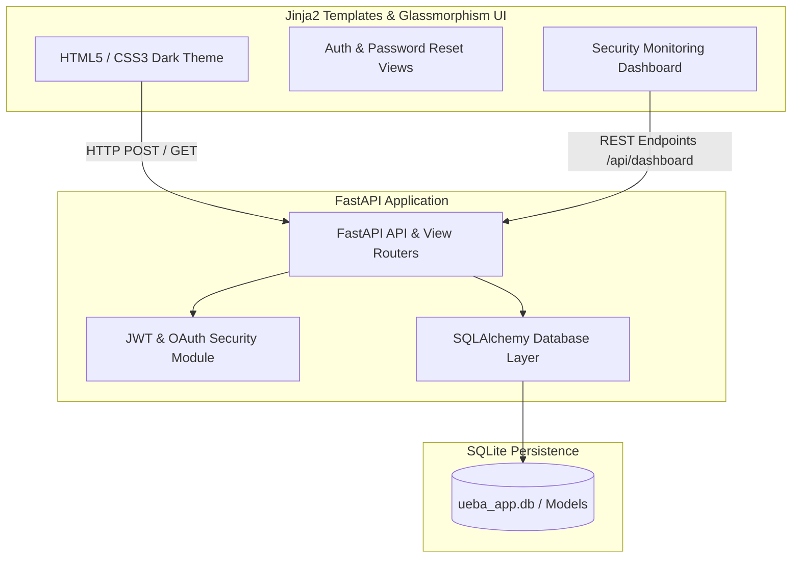

# 🛡️ UBEA Threat Detection — User & Entity Behavior Analytics

A full-stack User and Entity Behavior Analytics (UEBA) application built with Python FastAPI and SQLite, featuring real-time event activity logging, anomaly alert tracking, JWT authentication, OAuth2 integration, and a dark neon glassmorphism dashboard.

🔗 **GitHub Repository:** [github.com/Pavitran2006/UBEA-threat-detection](https://github.com/Pavitran2006/UBEA-threat-detection)

---

## ✨ Features

- 🔐 **JWT & OAuth2 Authentication:** Secure JWT cookie session handling with bcrypt password hashing and OAuth2 integration support (Google, GitHub, Microsoft via Authlib).
- 🔑 **Secure Password Recovery Workflow:** Email token-based password reset mechanism with 15-minute token expiration and password complexity enforcement.
- 📊 **Security Dashboard:** User monitoring dashboard featuring real-time login activity logging, suspicious IP tracking, and risk score indicators.
- 🚨 **Anomaly Alert Management:** Administrator alert review interface allowing security analysts to inspect high-risk event alerts and submit feedback actions.
- 🎨 **Glassmorphism Dark UI:** Styled UI built with custom CSS3 backdrop blur filters, Poppins typography, and CSS micro-interactions.

---

## 🏗️ Architecture



---

## 🛠️ Tech Stack

- **Backend:** Python 3.10+, FastAPI, Uvicorn, SQLAlchemy 2.0, Authlib, PyJWT, Passlib (Bcrypt)
- **Frontend:** Jinja2 HTML Templates, CSS3 (Glassmorphism), JavaScript (Fetch API)
- **Database:** SQLite (`ueba_app.db`)
- **Testing:** Pytest (`test_auth.py`, `test_login.py`)

---

## 📂 Project Structure

```text
UBEA-threat-detection/
├── app/
│   ├── main.py            # Main FastAPI application entry & view routes
│   ├── auth.py            # JWT token creation, bcrypt hashing & OAuth logic
│   ├── database.py        # SQLAlchemy SQLite connection setup
│   └── models.py          # User, Activity, Alert, PasswordResetToken models
├── templates/             # Jinja2 HTML templates
│   ├── home.html          # Landing page
│   ├── login.html         # Login view with OAuth options
│   ├── signup.html        # Registration view
│   ├── dashboard.html     # Security analytics dashboard
│   ├── forgot_password.html # Password recovery request view
│   └── reset_password.html  # Token validation & new password view
├── static/
│   ├── css/style.css      # Dark glassmorphism stylesheet
│   └── js/                # Client-side form handlers
├── AUTHENTICATION_GUIDE.md # Comprehensive authentication system docs
├── requirements.txt       # Python dependency manifest
└── ueba_app.db            # SQLite database file
```

---

## ⚙️ How It Works

1. **Authentication Flow:** Users authenticate via `/login` or OAuth2 providers. Upon valid credentials, a signed HTTP-only JWT token cookie is generated.
2. **Activity Logging:** Each user session logs IP address, timestamp, device metadata, and calculated risk indicators into the `Activity` SQLite table.
3. **Alert Monitoring:** Suspicious logins or flagged activities generate `Alert` table records with risk scores, visible to administrators in `/dashboard`.
4. **Password Reset:** `/forgot-password` generates a random 64-character token stored in `PasswordResetToken` with an expiration timestamp, dispatching a secure reset link.

---

## 🚀 Getting Started

### Prerequisites
- Python 3.9+

### Installation & Execution

1. **Clone the repository:**
   ```bash
   git clone https://github.com/Pavitran2006/UBEA-threat-detection.git
   cd UBEA-threat-detection
   ```

2. **Create and activate virtual environment:**
   ```bash
   python -m venv .venv
   
   # Windows:
   .venv\Scripts\activate
   # Linux/macOS:
   source .venv/bin/activate
   ```

3. **Install Python dependencies:**
   ```bash
   pip install -r requirements.txt
   ```

4. **Launch the FastAPI Server:**
   ```bash
   uvicorn app.main:app --reload --port 8000
   ```
   Open `http://localhost:8000` in your web browser.

---

## 🧪 Testing

Run backend test suites covering authentication, user creation, and JWT token validation:

```bash
pytest test_auth.py test_login.py
```

---

## 🌐 Deployment

- Designed for containerized local execution or serverless Python hosting.

---

## 🔮 Future Improvements

- [ ] Add active streaming anomaly detection using Isolation Forest / One-Class SVM models.
- [ ] Migrate database configuration layer to PostgreSQL for enterprise production workloads.
- [ ] Add WebHook notification alerts for critical security events.

---

## 👨‍💻 Author

**Pavitran Anand**  
- GitHub: [github.com/Pavitran2006](https://github.com/Pavitran2006)  
- LinkedIn: [linkedin.com/in/pavitrananand](https://linkedin.com/in/pavitrananand)  